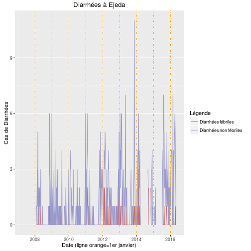
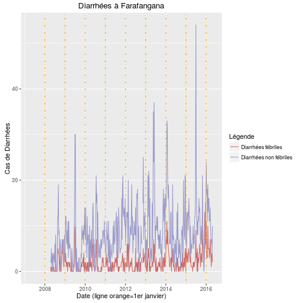

|Sites                |6 semaines précédentes |Semaine dernière |
|:--------------------|:----------------------|:----------------|
|Ambovombe            |01-09-na-00-06-05      |4                |
|Ambatondrazaka       |04-05-11-03-06-04      |3                |
|Antsohihy            |02-00-02-00-00-01      |1                |
|Anjozorobe           |00-00-00-00-00-00      |0                |
|Antsirabe            |10-09-13-10-17-17      |18               |
|Belo sur Tsiribihina |na-na-na-na-na-na      |na               |
|Behoririka           |09-07-00-12-14-14      |20               |
|Ambato Boeny         |09-08-05-03-17-09      |3                |
|Ambositra            |04-02-05-03-05-06      |8                |
|Andohatapenaka       |14-05-08-10-21-12      |8                |
|Antsiranana I        |09-15-18-06-10-06      |1                |
|Mandritsara          |06-01-10-00-07-02      |5                |
|Ejeda                |04-03-04-05-06-05      |3                |
|Farafangana          |11-14-10-08-06-07      |4                |
|Fianarantsoa         |00-01-00-02-03-09      |3                |
|Ihosy                |01-00-02-01-01-00      |1                |
|Maevatanana          |15-26-14-10-35-69      |41               |
|Morondava            |11-10-13-09-23-10      |13               |
|Mahajanga            |na-na-na-na-na-na      |na               |
|Miandrivazo          |05-04-na-03-10-06      |1                |
|Manjakaray           |05-03-03-02-01-05      |1                |
|Mananjary            |14-16-12-04-06-09      |18               |
|Morombe              |02-02-02-00-08-12      |11               |
|Moramanga            |02-05-04-03-02-02      |1                |
|Maroantsetra         |na-na-04-02-08-04      |na               |
|Maintirano           |03-00-01-03-05-01      |0                |
|Nosy Be              |20-18-20-02-13-07      |9                |
|Sambava              |06-14-31-23-16-11      |17               |
|Ambodifototra        |00-01-01-02-02-00      |1                |
|Tsiroanomandidy      |01-04-07-11-05-09      |1                |
|Tolagnaro            |01-00-00-00-02-01      |0                |
|Toliary              |09-19-17-12-21-16      |19               |
|Toamasina            |02-01-05-06-03-04      |2                |
|Tsaralalana          |11-05-06-03-03-02      |5                |

|Sites                |6 semaines précédentes |Semaine dernière |
|:--------------------|:----------------------|:----------------|
|Ambovombe            |00-00-na-00-00-00      |0                |
|Ambatondrazaka       |01-02-03-00-00-00      |0                |
|Antsohihy            |00-00-00-00-00-01      |1                |
|Anjozorobe           |00-00-00-00-00-00      |0                |
|Antsirabe            |03-04-06-03-03-01      |4                |
|Belo sur Tsiribihina |na-na-na-na-na-na      |na               |
|Behoririka           |00-00-00-00-00-00      |0                |
|Ambato Boeny         |03-01-00-00-06-04      |0                |
|Ambositra            |01-00-01-01-00-00      |1                |
|Andohatapenaka       |01-02-02-02-09-01      |1                |
|Antsiranana I        |00-02-07-00-00-00      |0                |
|Mandritsara          |02-00-03-00-03-00      |2                |
|Ejeda                |00-00-00-00-00-01      |0                |
|Farafangana          |04-07-05-03-01-04      |4                |
|Fianarantsoa         |00-00-00-00-00-00      |0                |
|Ihosy                |00-00-01-00-00-00      |1                |
|Maevatanana          |11-14-04-06-13-31      |20               |
|Morondava            |01-00-00-00-03-00      |0                |
|Mahajanga            |na-na-na-na-na-na      |na               |
|Miandrivazo          |02-01-na-01-08-02      |0                |
|Manjakaray           |02-00-01-01-00-00      |0                |
|Mananjary            |00-00-00-00-00-00      |0                |
|Morombe              |00-00-00-00-01-01      |0                |
|Moramanga            |00-00-03-00-01-01      |1                |
|Maroantsetra         |na-na-00-01-01-01      |na               |
|Maintirano           |01-00-00-01-04-00      |0                |
|Nosy Be              |12-08-10-00-06-01      |4                |
|Sambava              |00-00-01-00-00-00      |1                |
|Ambodifototra        |00-01-00-01-01-01      |0                |
|Tsiroanomandidy      |01-00-03-03-01-00      |0                |
|Tolagnaro            |01-00-00-00-01-00      |0                |
|Toliary              |02-05-03-03-06-03      |6                |
|Toamasina            |01-00-02-02-01-02      |1                |
|Tsaralalana          |00-00-01-01-00-00      |1                |

