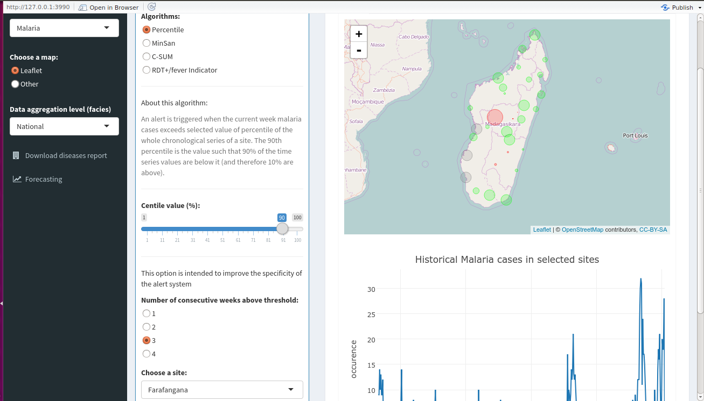
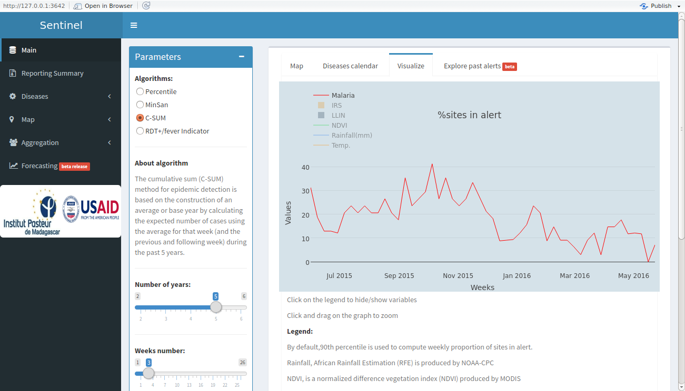

# Sentinel
A toolkit for visualization, early detection and prediction of disease outbreaks (Malaria, Diarrhea, etc.)

## Goals:
* Build a package that could receive any kind of algorithms for epidemiologists to play with.
* Automate data processing and conversion for any kind of format and backend.

## Sentinel as a reporting tool (in `report` folder):
* Produce pdf LateX documents to summarize situation of sentinel sites (plots, trends and tables).
* Produce word docx documents to display historical alerts and summary report on SMS sent to our postgres database for each sentinel sites.

## Packages requirements:

* Have a look at `libraries.R`

## Algorithms used to trigger alert:

## Percentile algorithm:

`Percentile` algorithm is used to trigger alert in sentinel network. An alert is triggered when during `n` (consecutive or not) week(s) , diseases occurrence exceeds `90th percentile` calculated using the entire historical time series. This calculation of `90th percentile` excludes the current week.

### Default values for percentile algorithm are:

* `n` number of consecutive weeks we observe = 3
* value of the percentile = 90th 

## MinSan algorithm:

`MinSan` or Ministry of Health (in english) is a simple rule that tells that if occurrences of a given `disease` exceed a certain proportion (`slope parameter (value)`) during `n` ( 3 or 4 ) consecutive weeks or not then an `alert` is triggered.

## CSum algorithm:

`CSum` algorithm consists of comparing `52 lastest weeks` with smoothed mean of past years. Comparison is made week by week. For example,`week 02` of this month is compared with the smoothed mean of `week 02` for past years excluding the 52 latest. Parameters can be tuned such as number of past years from which mean will be calculated, `sd`, degree of smoothing (number of weeks for mean calculation) .It is only efficient when disease presents weekly strong seasonal pattern.

