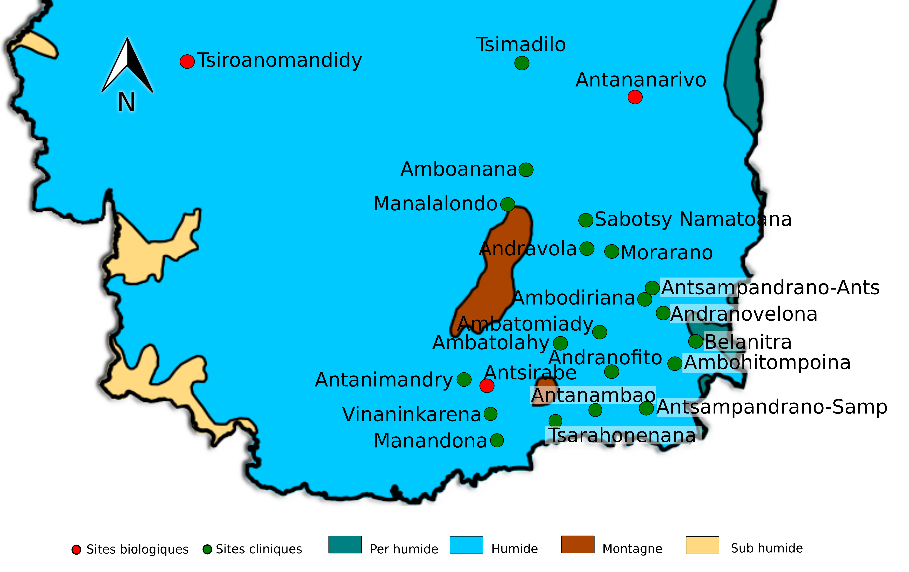

```{r,echo=F,fig.width=10, out.extra='',comment='', message=FALSE , warning=FALSE}
source("import1.r");source("preprocessing.R");require(ggplot2); require(gridExtra)
#Retrieve Malaria (TDR+ ~~PaluConf) for HTC sites
mydata= preprocessing_disease(select_htc=TRUE)[["Malaria"]]
setnames(mydata,"occurence","palu")
#Retrieve Malaria autochtone for HTC sites:
palu_autoch= fread("palu_autoch.csv")
palu_autoch=palu_autoch[as.Date(deb_sem)>=as.Date("2015-06-01"),]

palu_autoch=as.data.table(gather(palu_autoch,
                                 key=sites,value=autoch,-c(code,deb_sem)))
#Merge autochtone & Palu (all)
mydata=merge(mydata,palu_autoch[,list(code,sites,autoch)],
             by.x=c("code","sites"),by.y=c("code","sites"),all.x=T,all.y=T)
#preprocess data:
mydata=mydata[as.Date(deb_sem)>=as.Date("2015-06-01"),]
#Calculate Palu Importé:
mydata[,palu_importe:=as.numeric(palu)-as.numeric(autoch),by="code,sites"]
#make a copy of data because we're going to transform it during plotting
X=mydata
X[is.na(palu)==T,palu:=0]
X[is.na(autoch)==T,autoch:=0]
X[is.na(palu_importe)==T,palu_importe:=0]
#aggregate data:
X[,autoch:=sum(autoch),by="code"]
X[,palu_importe:=sum(palu_importe),by="code"]

Z1=unique(X[,list(deb_sem,autoch)]); setnames(Z1,"autoch","vals")
Z1[,Légende:="Palu autochtone"]

Z2=unique(X[,list(deb_sem,palu_importe)]); setnames(Z2,"palu_importe","vals")
Z2[,Légende:="Palu importé"]

X= rbind (Z1,Z2); rm(Z1);rm(Z2)
X$deb_sem=as.Date(X$deb_sem)

 d=ggplot(X, aes(x=deb_sem, y=vals, fill = Légende, colour = Légende)) 
 d= d + geom_bar(stat = "identity") 
 d= d + scale_fill_manual(values=c("#CC6666", "#9999CC"))
 d= d + scale_color_manual(values=c("#CC6666", "#9999CC"))
 d= d + ggtitle(label="Cas de Paludisme (autochtone vs Importé)")
 d= d + xlab("Date") + ylab("Nb. Cas")
print(d)
```

```{r,echo=F,out.extra='',comment='', message=FALSE , warning=FALSE}

semaine=array()
max_deb_sem=max(as.Date(palu_autoch$deb_sem))
semaine[6]= max_deb_sem-2*7 
p=1
for ( k in 2:6 )
{
  semaine[p]=semaine[6]-(k-1)*7
  p=p+1
}
# selection for last 6 weeks before current week for Palu autochtone:
last6_palu_autoch=palu_autoch[as.Date(deb_sem) %in% semaine,list(deb_sem,sites,autoch)]


#transform NA into XX
last6_palu_autoch$autoch=as.character(last6_palu_autoch$autoch)
last6_palu_autoch[,autoch:=ifelse(is.na(autoch)==T,"XX",autoch)]
last6_palu_autoch[,autoch:=ifelse(nchar(autoch)<2,paste0("0",autoch),autoch)]


#inline historical occurence:
last6_palu_autoch[,vals:=paste(autoch,collapse = "-"),by="sites"]
last6_palu_autoch[,autoch:=NULL]
last6_palu_autoch= merge(unique(last6_palu_autoch[,list(sites,vals)]), 
               unique(palu_autoch[as.Date(deb_sem)==max_deb_sem-7, list(sites,autoch)]), by.x="sites", by.y="sites")
                                 
setnames(last6_palu_autoch,c("sites","vals","autoch"),
                c("Sites","6 semaines précédentes","Semaine dernière"))

# #generate tables:
knitr::kable(last6_palu_autoch,
              caption="Paludisme autochtone dans le réseau sentinelle HTC")
```

```{r,echo=F, fig.show = "hold"  ,out.width ='50%',out.extra='',comment='',message=FALSE , warning=FALSE}

#loop and plot:


mydata= preprocessing_disease(select_htc=TRUE)[["Malaria"]]
setnames(mydata,"occurence","palu")
myname = as.character(unique(mydata$sites))
mydata=mydata[as.Date(deb_sem)>=as.Date("2015-06-01"),]

for ( p in myname )
     {
      disease1=mydata[sites==p,list(sites,deb_sem,palu)]
      disease1[is.na(palu)==T,palu:=0]
      disease1[,Légende:="Importe"]
      
      disease2= palu_autoch[sites==p,list(sites,deb_sem,autoch)]
      disease2[is.na(autoch)==T,autoch:=0] 
      
      #merge to calculate palu_importe
      disease1=merge(disease1,disease2[,list(deb_sem,autoch)],
                     by.x="deb_sem",by.y="deb_sem")
      disease1[is.na(autoch)==T,autoch:=0] 
      disease1[,palu_importe:=palu-autoch]
      setnames(disease1,"palu_importe","value")
      disease1=disease1[,list(sites,deb_sem,value,Légende)]
      
      
      setnames(disease2,"autoch","value")
      disease2[,Légende:="autoch"]
             
      X=rbind(disease2, disease1)
      X$deb_sem=as.Date(X$deb_sem)
      setnames(X,"deb_sem","Date")
   
      d= ggplot(data=X,aes(x=Date,y=value,fill=Légende,colour=Légende))
      d=d + geom_bar(stat = "identity") 
      d= d + scale_fill_manual(values=c("#CC6666", "#9999CC"))
      d= d + scale_color_manual(values=c("#CC6666", "#9999CC"))
      d=d + ggtitle(label=p)
      d=d + xlab("Date") + ylab("Nb. Cas")
      print(d)
}

```

