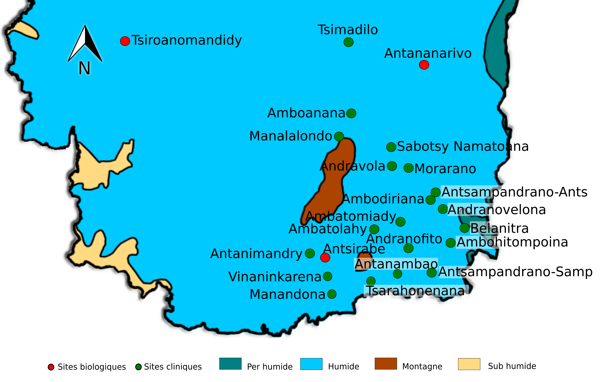

|Centre            |6 semaines précédentes |Semaine dernière |
|:-----------------|:----------------------|:----------------|
|amboanana         |na-na-na-na-na-na      |na               |
|ambatolahy        |na-na-na-na-na-00      |na               |
|antsampandrano    |na-02-00-00-01-02      |0                |
|belanitra         |na-00-na-na-na-na      |0                |
|ambodiriana       |na-na-na-na-na-na      |na               |
|ambodiriana       |na-na-na-na-na-na      |0                |
|manandona         |na-na-na-na-na-na      |na               |
|andranofito       |00-00-00-00-00-00      |na               |
|andranofito       |00-00-00-00-00-00      |0                |
|antanimandry      |na-na-na-na-na-na      |na               |
|ambatomiady       |00-na-00-na-na-na      |0                |
|manalalondo       |na-na-na-na-na-na      |na               |
|morarano          |na-na-na-na-na-na      |na               |
|antsampandrano    |00-na-na-na-na-na      |na               |
|sabotsy namatoana |na-na-na-00-na-na      |na               |
|antanambao        |00-00-na-na-00-00      |0                |
|ambohitompoina    |na-na-na-na-na-01      |na               |
|tsarahonenana     |na-na-na-na-na-na      |na               |
|tsimadilo         |17-15-13-12-25-18      |2                |
|tsimadilo         |17-15-13-12-25-18      |7                |
|andranovelona     |00-na-na-00-na-na      |na               |
|vinanikarena      |na-na-na-na-na-na      |na               |
|andranovola       |na-na-na-na-na-na      |na               |

